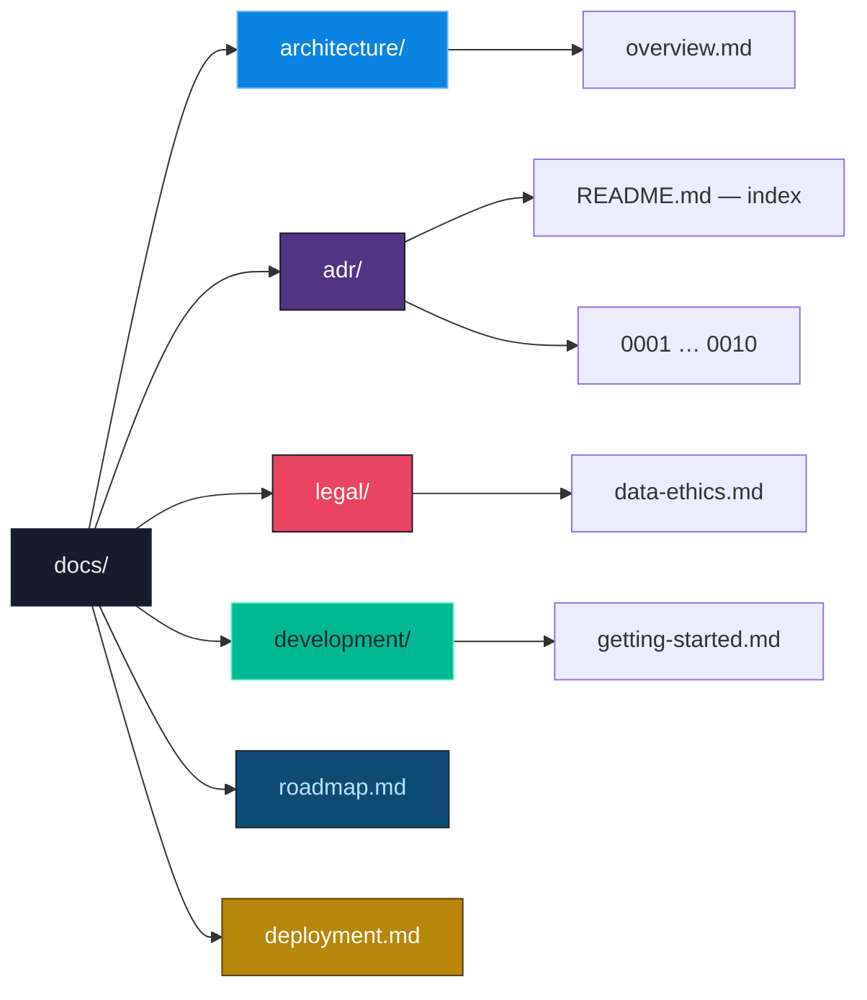

# eye — documentation

`eye` is a local OSINT gateway for Córdoba: a live model of the city assembled
from public sources only, shipped as a single Go binary.

## Map

## Sections

| Section | What it covers | Read it when |
|---|---|---|
| [architecture/](./architecture/overview.md) | The shape of the binary, the data flow, a poll cycle, layer rules, package map | Before writing any code |
| [adr/](./adr/README.md) | The ten decisions this project is built on, and what each one costs | When you want to change one of them |
| [legal/](./legal/data-ethics.md) | Reuse, retention, the decision table, the source checklist | Before adding a source or touching camera media |
| [development/](./development/getting-started.md) | Build, test, configure, add a provider | Day one |
| [roadmap.md](./roadmap.md) | The nine epics, their dependencies, effort estimates | When picking up work |
| [deployment.md](./deployment.md) | Running the API privately: the token, Docker, systemd, TLS, and the one source that needs a certificate installed | When it leaves your laptop |

## Start here

| If you want to… | Read |
|---|---|
| Understand what eye is | [architecture/overview.md](./architecture/overview.md) |
| Build and run it | [development/getting-started.md](./development/getting-started.md) |
| Add a data source | [legal/data-ethics.md](./legal/data-ethics.md#adding-a-source-the-checklist), then [getting-started](./development/getting-started.md#adding-a-source-provider) |
| Know why it is one binary | [ADR-0001](./adr/0001-single-binary-several-modes.md) |
| Know what eye refuses to do | [ADR-0007](./adr/0007-ethical-boundary.md) |
| Know why there are three front ends | [ADR-0010](./adr/0010-three-surfaces-one-model.md) |
| Deploy it somewhere | [deployment.md](./deployment.md) |
| Pick up a task | [roadmap.md](./roadmap.md) |

## The two files that are contracts, not config

- **`configs/sources.yaml`** — nothing is fetched that is not declared there,
  and nothing is fetched automatically unless it says `automation: enabled`.
- **`configs/rules.yaml`** — every correlation rule, and the disclaimer that
  goes out with each one.
