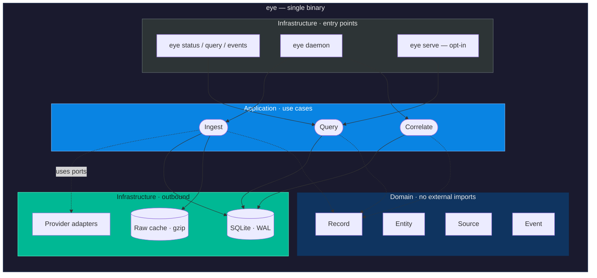
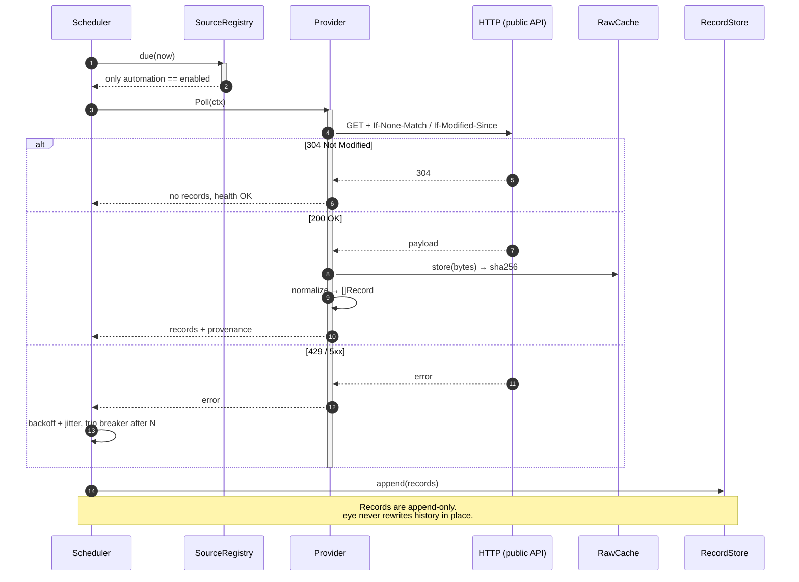
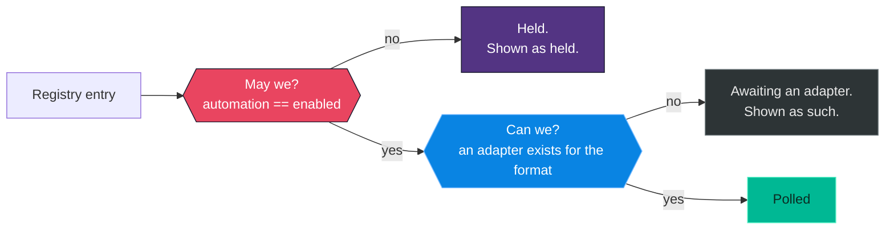

# Architecture overview

## Responsibility

`eye` builds and answers questions about a live model of Córdoba, assembled
exclusively from public sources. It is not a camera viewer and not a dashboard
wrapper around a handful of APIs: it is a small geo-temporal data fusion centre
where traffic, buses, fires, weather, water, flights, public documents and
scheduled events are all just different kinds of **observation**.

The whole thing ships as **one binary with no mandatory services**. Deployment
is `scp eye server:/usr/local/bin/`.

## The shape of the binary



The important property: **`serve` is one adapter among several, not the centre
of the system**. A future web map or Cesium client plugs into the same
application layer without a single provider being rewritten.

## From source to answer

```mermaid
flowchart LR
    subgraph Public["Public sources"]
        direction TB
        DGT["DGT · DATEX II"]
        AEMET["AEMET · OpenData"]
        FIRMS["NASA FIRMS"]
        CKAN["CKAN Córdoba"]
        GTFS["GTFS / GTFS-RT"]
        AGENDA["Agendas · ICS/HTML"]
        DOCS["BOE · BOP · PLACSP"]
    end

    Public --> REG{{"Source registry<br/>automation gate"}}
    REG -->|enabled| ADAPT["Provider adapters"]
    REG -->|review_terms / manual_link| HELD["Not fetched.<br/>Shown as held."]

    ADAPT --> RAWC[("Raw cache<br/>bytes + SHA-256")]
    ADAPT --> NORM["Normalizer"]
    NORM --> RESOLVE["Entity resolver<br/>+ dedupe"]
    RESOLVE --> DB[("Record store")]
    DB --> FUSE["Rule engine"]
    FUSE --> ALERT["Inference<br/>quality = inferred"]
    ALERT --> OUT["status · query · radar · SSE"]
    RAWC -.->|replay| FUSE

    style Public fill:#0f4c75,stroke:#1b262c,color:#bbe1fa
    style REG fill:#e94560,stroke:#1a1a2e,color:#fff
    style HELD fill:#533483,stroke:#1a1a2e,color:#fff
    style DB fill:#00b894,stroke:#55efc4,color:#0b2b22
    style RAWC fill:#00b894,stroke:#55efc4,color:#0b2b22
    style ALERT fill:#e94560,stroke:#1a1a2e,color:#fff
```



Two things in that diagram are load-bearing:

1. **The automation gate comes before the adapter.** A source that is not
   explicitly `enabled` is never fetched, and its held state is visible in
   `eye status` rather than silently missing.
2. **The raw cache feeds back into fusion.** Every inference can be replayed
   from the exact bytes it was derived from.

## One poll cycle



## Layer rules

Hexagonal per domain, inherited from the Hagalink `backend-go` template and
adapted from an HTTP service to a CLI.

| Layer | May import | Must NOT import |
|---|---|---|
| `<domain>/domain` | stdlib only | anything else in the project, any driver, `net/http` |
| `<domain>/application` | its own and other `domain` packages | `infrastructure`, `net/http`, storage drivers |
| `<domain>/infrastructure` | `application`, `domain`, drivers, `net/http` | (no cycles) |
| `internal/cli` | everything under `internal/` | — |
| `cmd/eye` | `internal/cli` only | — |

## Package map

```
cmd/eye/                    composition root — the only main package
internal/
  cli/                      commands, argument parsing, output rendering
  config/                   configuration; the only place os.Getenv is called
  httpx/                    the shared outbound client: timeouts, size caps,
                            conditional requests, Retry-After, charset decoding,
                            and recording every payload into the raw cache
  logging/                  log/slog setup; text on a terminal, JSON otherwise
  scheduler/                the polling loop, and the policy it runs on:
                            jitter, backoff, circuit breaker, host concurrency
  version/                  build identity, injected via -ldflags
  observation/              THE CORE — what eye knows and how it knows it
    domain/                 Record, Entity, Provenance, Point, BBox, Filter, ports
    application/            the collector: poll providers, store what comes back
    infrastructure/         SQLite store (WAL, CGO-free), content-addressed
                            raw cache, and an in-memory store for tests
  source/                   the registry: which feeds we may read, and on what terms
    domain/                 Source, Access, AutomationStatus
    infrastructure/         YAML registry loader
  provider/                 adapters for external sources
    domain/                 Provider, StreamingProvider, EntityProvider, Health
    infrastructure/         factory (format → adapter), plus one package per format:
                            rss/, ckan/, adsblol/
configs/
  embed.go                  compiles the registry into the binary
  sources.yaml              the source registry — the legal contract of the project
  rules.yaml                correlation rules
docs/                       these documents
testdata/                   recorded source fixtures, so tests never hit the network
```

Packages that the roadmap calls for but that do not exist yet — `fusion/`,
`event/` — are created by the epic that fills them. An empty package is a
promise, and the tree should only contain code.

## The scheduler, and why its policy is a separate file

`scheduler/policy.go` holds backoff, jitter and the circuit breaker as pure
functions of state. `scheduler/scheduler.go` holds the loop that uses them.

That split is deliberate. The interesting behaviour — does a failing source
back off, does a tripped breaker stop calling it, does a recovery clear the
count — is exhaustively testable without a single sleep. The loop itself takes
an injectable clock, so even its tests run in microseconds rather than in the
hours the intervals describe.

## Two gates, not one

A source is fetched only when it passes both:



They fail for different reasons and are reported separately. Collapsing them
into "source unavailable" would hide the difference between a licence question
and an unwritten parser.

## Why not the two-binary gateway

The research that seeded this project proposed `eyed` (daemon + REST + SSE)
plus `eye` (HTTP client). That is the right destination and the wrong starting
point: it front-loads network configuration, CORS, auth and API versioning
before a single provider exists.

One binary with modes keeps every one of those doors open at a fraction of the
cost. See [ADR-0001](../adr/0001-single-binary-several-modes.md).
