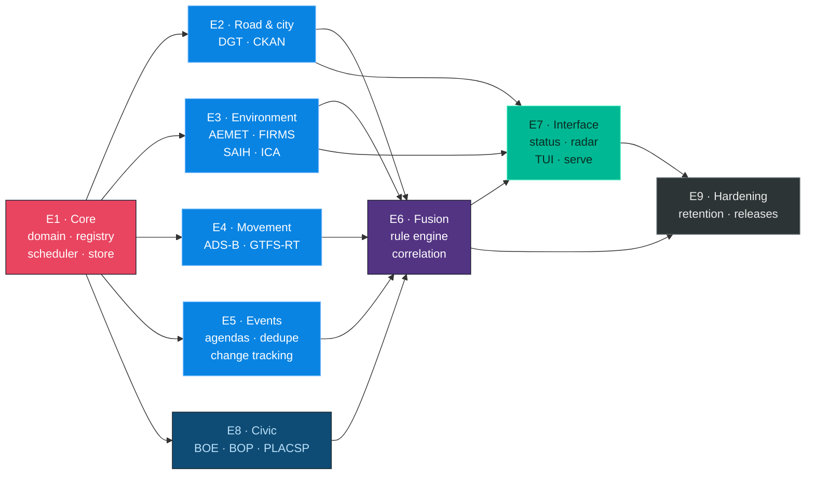

# Roadmap

Nine epics. Each one is a GitHub milestone; each issue inside it is meant to be
a single reviewable pull request.

The ordering is a dependency order, not a schedule. Effort figures are
engineering estimates for one experienced Go developer — not calendar dates and
not commitments.

## Dependency graph



`E1` is the only hard blocker. Once the core exists, the four source epics are
independent of each other and can be picked up in any order — or in parallel by
different people.

## Epics

### E1 · Core — the spine

Everything else plugs into this.

- [x] Source registry loader and validation from `configs/sources.yaml`
- [x] Shared HTTP client: timeouts, body caps, conditional requests,
      `Retry-After`, charset decoding
- [x] Source health tracking, reported per source
- [x] The collector: bounded-concurrency polling that isolates failures
- [x] `eye status` rendering source health, including held sources
- [x] Scheduler loop: jitter, exponential backoff, circuit breaker, per-host
      concurrency limits, bounded startup stagger
- [x] SQLite store (WAL, CGO-free) behind the domain port, with retention
- [x] Raw cache: gzipped payloads addressed by SHA-256, integrity-checked on read
- [x] Structured logging with `log/slog`
- [x] `eye daemon`, and `--offline` for querying without touching the network

**E1 is complete.** *Estimate was 28–40 h.*

### E2 · Road and city

- [x] Generic CKAN provider, reusable for any municipality
- [x] Córdoba CKAN camera inventory (32 cameras) and catalog change detection
- [ ] Resolve DGT access: `nap.dgt.es` answers `403` to automated clients
- [ ] Generic DATEX II 3.7 reader, driven by the published XSD
- [ ] DGT incident provider
- [ ] DGT camera **inventory** provider — positions and metadata only

*Estimate: 24–36 h*

### E3 · Environment

- AEMET provider, handling the two-step `datos` URL protocol
- NASA FIRMS provider (thermal anomalies)
- MITECO ICA provider (air quality)
- INFOCA daily risk raster via WMS
- SAIH Guadalquivir adapter — **only** once its reuse terms are resolved;
  readings are recorded as `quality: preliminary`
- IGN seismic catalogue

*Estimate: 28–42 h*

### E4 · Movement

- [x] adsb.lol provider with a configurable viewport and per-record expiry
- [ ] OpenSky provider with OAuth2 — held on licence review for non-personal use
- Generic GTFS parser (static)
- Generic GTFS-RT parser (protobuf)
- RENFE provider: TripUpdates + VehiclePositions
- AUCORSA static GTFS
- Retention policy: `ExpiresAt` on movement records, aggregates for the long term

*Estimate: 28–42 h*

### E5 · Events — what Córdoba is about to do

The second axis of the project. Not a calendar: a tracker.

- `Event` domain with a status machine — `scheduled`, `confirmed`, `changed`,
  `postponed`, `cancelled`, `sold_out`, `finished`
- Fingerprint deduplication: normalised title + venue + start time truncated to
  30 minutes, plus fuzzy matching for the rest
- Observation model: one canonical event, many source observations, confidence
  rising with independent agreement
- Change detection producing `EVENT_CHANGE` diffs
- [x] UCO events provider (its RSS feed, where `pubDate` is the event start)
- [x] `eye events`, sorted by start time
- [ ] Agenda Única, Turismo de Córdoba, IMAE — pending a licence answer
- [ ] `eye event <query>`, `eye events --new|--changed|--cancelled`

*Estimate: 30–45 h*

### E6 · Fusion

- Spatio-temporal windowing over the record store
- Rule engine reading `configs/rules.yaml`
- The four seed rules: wildfire, flood watch, transport disruption, smoke impact
- Confidence scoring from independent source agreement
- Provenance graph: every inference resolves to the raw payloads behind it
- Every output labelled `quality: inferred`, with its disclaimer

*Estimate: 30–45 h*

### E7 · Interface

- [x] `eye status` — the city in one screen
- [x] `eye query --topic --since --text --source`, and `--json` everywhere
- [x] `eye news`, `eye civic`, `eye sky`, `eye cameras`, `eye sources`
- [ ] `eye query --bbox`
- `eye radar` — the next 72 hours
- `eye tonight`, `eye whatsup`
- Bubble Tea TUI with source health, timeline and filters
- Image preview through Kitty Graphics / chafa, in a suspended terminal rather
  than inside the render loop
- `eye serve` — REST + SSE, opt-in

*Estimate: 24–36 h*

### E8 · Civic intelligence

The unglamorous half, and where the early signals live. A large event leaves a
public trace — a contract, an authorisation, a road closure — months before it
is announced.

- [x] BOE RSS (served as ISO-8859-1, decoded before parsing)
- [ ] BOE OpenData API for the full document text
- BOP Córdoba
- PLACSP public procurement
- Diputación de Córdoba CKAN
- Full-text search over documents
- Weak-signal detection: a `POSSIBLE EVENT` with a confidence score and its
  signals listed, never an assertion that something will happen

*Estimate: 24–36 h*

### E9 · Hardening

- Retention enforcement and compaction into aggregates
- Metrics: latency, error rate, freshness per source
- Recorded fixtures in `testdata/` so no test touches the network
- Cross-compiled release binaries via release-please
- Privacy and licence documentation kept in step with the registry

*Estimate: 32–48 h*

## Where the project stands

Eight sources answer live in under a second: three Córdoba newspapers, the BOE,
the UCO events feed, the municipal open-data catalog, the municipal camera
inventory, and live aircraft. Sixteen more are declared and held, five are
permitted but await an adapter, and `eye sources` tells the three apart.

**v0.1** delivered the sources and the commands. **E1 closed after it**:
observations now persist in SQLite, every payload is kept as evidence, the
scheduler runs them on their own intervals with backoff and a circuit breaker,
and `eye daemon` keeps the picture current.

The next slice is the one the whole design exists for. With persistence in
place, eye can finally compare what a source says today against what it said
yesterday — which is what turns a set of feeds into change detection, and what
E5 (events) and E6 (fusion) are both built on.

## Order of magnitude

Roughly **220–320 hours** in total. The variance sits in three places: whether
SAIH and INFOCA ever offer a stable contract, how exhaustively DATEX II gets
parsed, and how far event deduplication has to go before it stops producing
six copies of the same concert.

## The version that matters

The goal is not `eye cameras`. It is `eye status` answering, from evidence:

```
CÓRDOBA · 28 AUG 2026 21:38

City state: NORMAL

Signals:
  DGT       2 active road incidents < 50 km
  FIRMS     no correlated fire signal < 50 km
  INFOCA    fire risk HIGH in western sector
  AEMET     no severe warning
  SAIH      river levels stable        (preliminary)
  ICA       air quality GOOD
  EVENTS    7 today · 2 with mobility impact

Correlations:
  No multi-source critical incident detected.

Sources:
  18 healthy
   1 stale
   3 held: reuse terms unresolved

Press [Enter] for evidence.
```

Every line of that traces back to a public source, and the last line is the
whole point.
